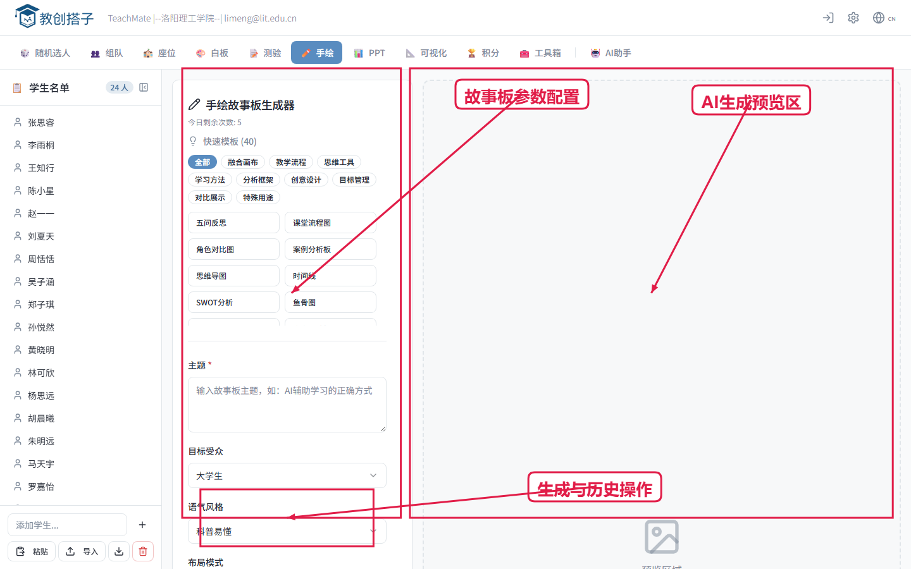
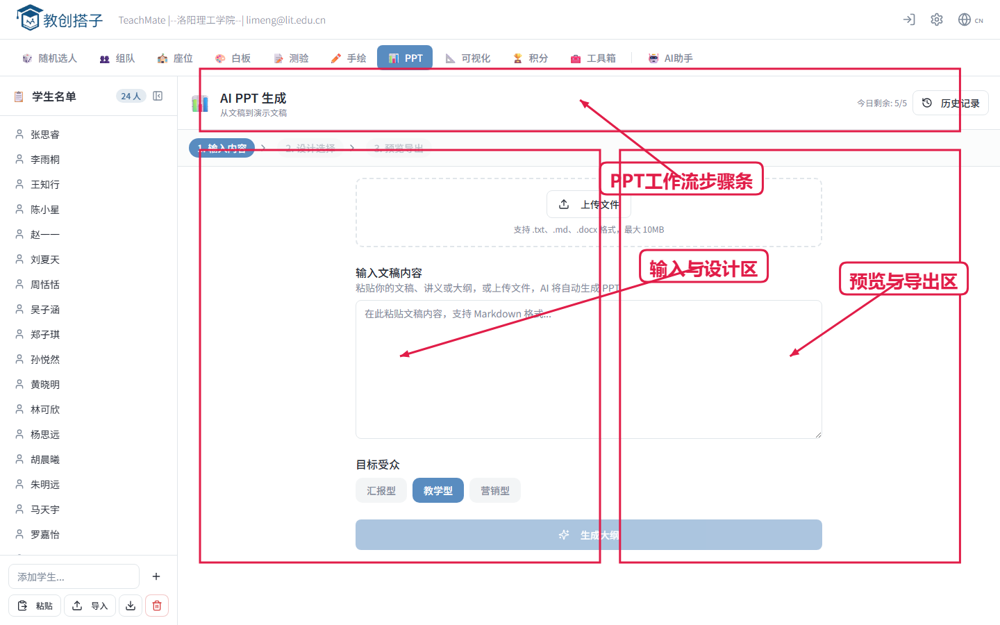
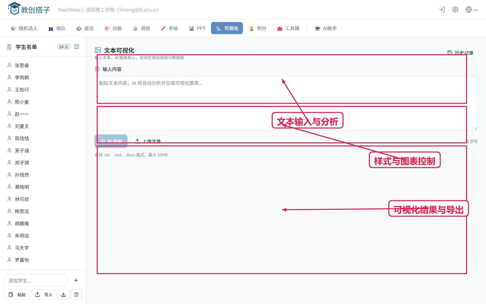

# 教创搭子 校内培训讲义（45分钟讲师备注版）

适用对象：校内教师培训、教研组工作坊、新教师上手。

培训总时长：45分钟

## 0. 培训节奏总览（45分钟）

1. 开场与目标对齐（3分钟）
2. 首页与名单班级库（5分钟）
3. 点名、分组、排座（10分钟）
4. 白板互动与测验（9分钟）
5. 成就系统与工具箱（6分钟）
6. AI三件套（8分钟）
7. 课后导出与复盘（2分钟）
8. Q&A 与任务布置（2分钟）

---

## 第1页 开场与系统定位（3分钟）

讲解词：
- 这是教创搭子的主工作台，一屏覆盖课堂高频动作。
- 今天我们只记一条主线：课前准备、课中互动、课后留档。
- 45分钟后，大家可以独立跑通一节课的完整流程。

提问点：
- 你们当前课堂里，最耗时的组织动作是哪一项？
- 你最希望“1分钟内完成”的课堂操作是什么？

演示时长：3分钟

---

## 第2页 手机端入口与移动操作（2分钟）

讲解词：
- 手机端适合课中快速触发：点名、二维码、计时、投票。
- 复杂编辑放在电脑端，课堂触发放在手机端。

提问点：
- 你更常用手机控场还是电脑控场？

演示时长：2分钟

---

## 第3页 名单与班级库（3分钟）

讲解词：
- 先加载班级，再做所有课堂动作，效率会显著提升。
- 名单支持粘贴导入、文本导入、班级库复用。

提问点：
- 你们学校名单主要来自教务系统导出还是手工维护？

演示时长：3分钟

---

## 第4页 随机点名（4分钟）

讲解词：
- 可选去重抽取，避免重复点名。
- 支持语音播报与弹窗展示，提升课堂仪式感。

提问点：
- 你需要完全随机，还是“随机+不重复”更符合教学节奏？

演示时长：4分钟

---

## 第5页 分组与建队（3分钟）

讲解词：
- 自动分配后拖拽微调，兼顾效率与教学判断。
- 可以快速形成讨论组或项目队。

提问点：
- 你们分组更常按人数均分，还是按能力混编？

演示时长：3分钟

---

## 第6页 多场景排座与移动端排座（3分钟）

讲解词：
- 支持教室、机房、会议等多场景，内置多种排座策略。
- 可结合座位签到，把“排座”变成“管理工具”。

提问点：
- 你当前课堂更需要考试排座还是讨论排座？

演示时长：3分钟

---

## 第7页 白板互动（4分钟）

讲解词：
- 用二维码让学生提交观点，教师端实时汇聚并展示。
- 适合头脑风暴、案例讨论、观点收敛。

提问点：
- 你更希望白板用于“收集答案”还是“引导讨论”？

演示时长：4分钟

---

## 第8页 随堂测验（5分钟）

讲解词：
- 题库建题、发布会话、统计回看一体化。
- 结束后可导出数据，用于学情分析与课堂反馈。

提问点：
- 你们更关注正确率、参与率，还是题目区分度？

演示时长：5分钟

---

## 第9页 成就系统（3分钟）

讲解词：
- 用积分和徽章形成可视化激励闭环。
- 适合过程性评价和小组竞争激励。

提问点：
- 你更希望激励个人还是激励小组？

演示时长：3分钟

---

## 第10页 工具箱（3分钟）

讲解词：
- 工具箱是课中“即插即用”组件，随需调用。
- 建议优先掌握：倒计时、二维码、投票、课堂指令卡。

提问点：
- 哪三个工具最可能在你下周课堂中立即使用？

演示时长：3分钟

---

## 第11页 AI故事板（2分钟）

讲解词：
- 输入主题即可快速生成可讲述的视觉故事板。
- 适合导入环节、情境教学和项目汇报。

提问点：
- 你会把故事板用于哪门课的哪个知识点？

演示时长：2分钟

---

## 第12页 AI PPT生成（3分钟）

讲解词：
- 从文本到大纲再到可导出课件，形成备课快车道。
- 可按受众、模板、配色、字体快速切换风格。

提问点：
- 你最希望AI帮你节省的是哪一步：大纲、排版还是视觉素材？

演示时长：3分钟

---

## 第13页 AI文本可视化（3分钟）

讲解词：
- 将长文本自动结构化，再转成信息图和图表。
- 适合政策解读、课程总结、研究结果展示。

提问点：
- 你有哪些文字材料适合直接转成可视化教学图？

演示时长：3分钟

---

## 第14页 课后导出与留档（2分钟）

讲解词：
- 课堂成果可导出为 PNG、PDF、CSV、PPTX。
- 建议建立“课后三件套”：排座图、测验数据、互动记录。

提问点：
- 你们学校目前的课堂留档标准是什么？

演示时长：2分钟

---

## 第15页 收尾：实操任务（3分钟）

讲解词：
- 请每组完成一次完整流程：名单 -> 点名 -> 分组 -> 排座 -> 白板/测验 -> 导出。
- 每组选一个场景做 1 分钟复盘分享。

提问点：
- 如果明天就上课，你会先上哪三个模块？为什么？

演示时长：3分钟

---

## 附录 A：讲师提示词（可口播）

- “先跑通主流程，再做个性化。”
- “课堂效率优先，界面美化第二步再做。”
- “每一项操作都要回到教学目标，不为了功能而功能。”

## 附录 B：培训后落地任务

1. 每位教师本周至少完成一次随堂测验发布。
2. 每个教研组建立一个标准班级模板。
3. 下一次教研会带来一份导出成果进行复盘。
