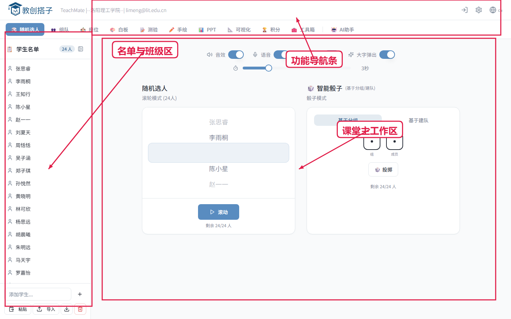
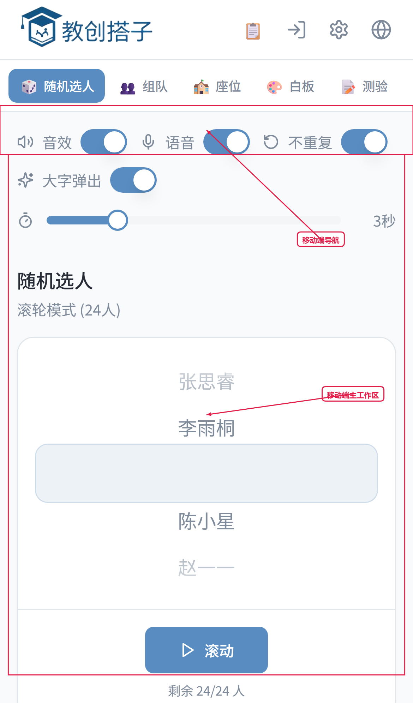
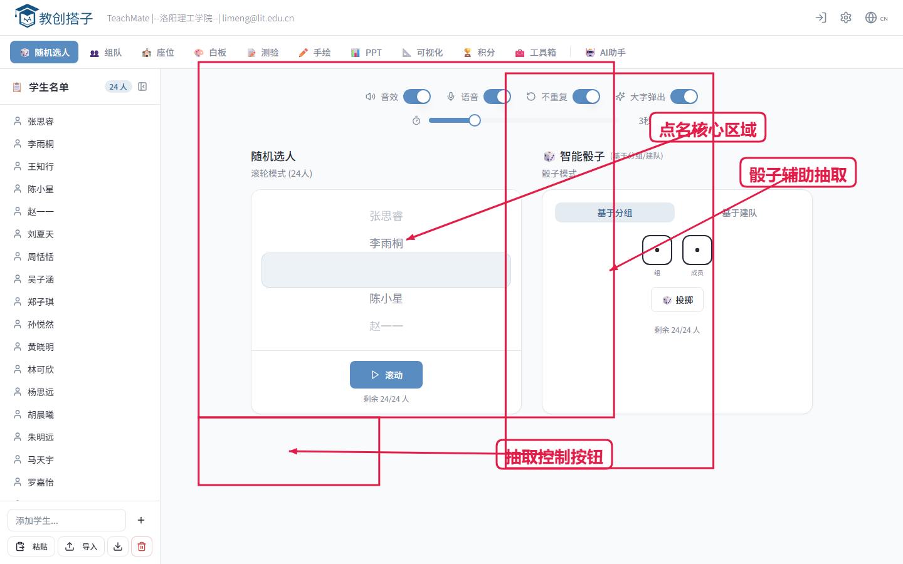
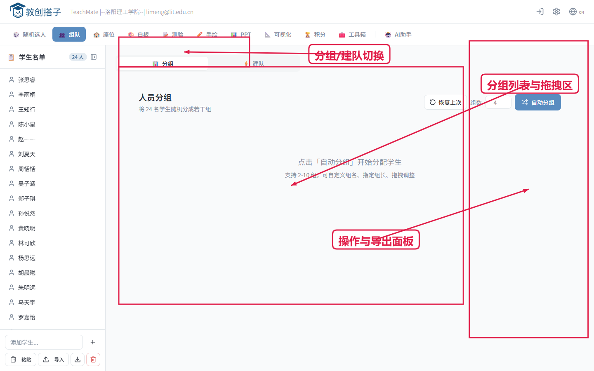
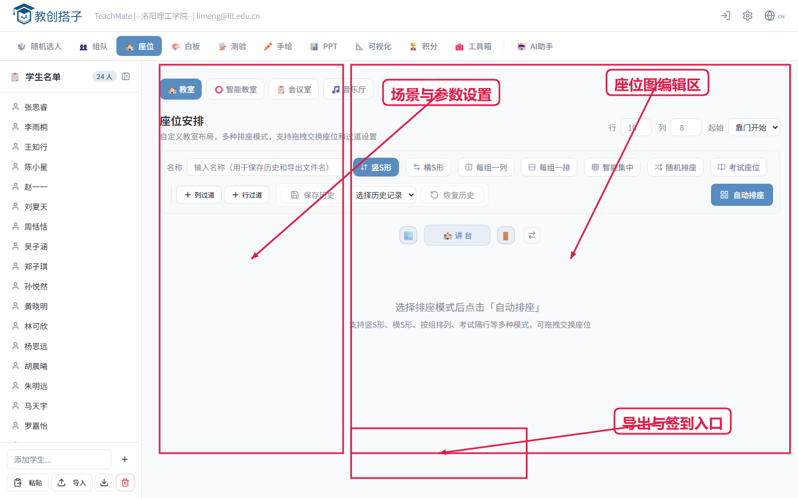
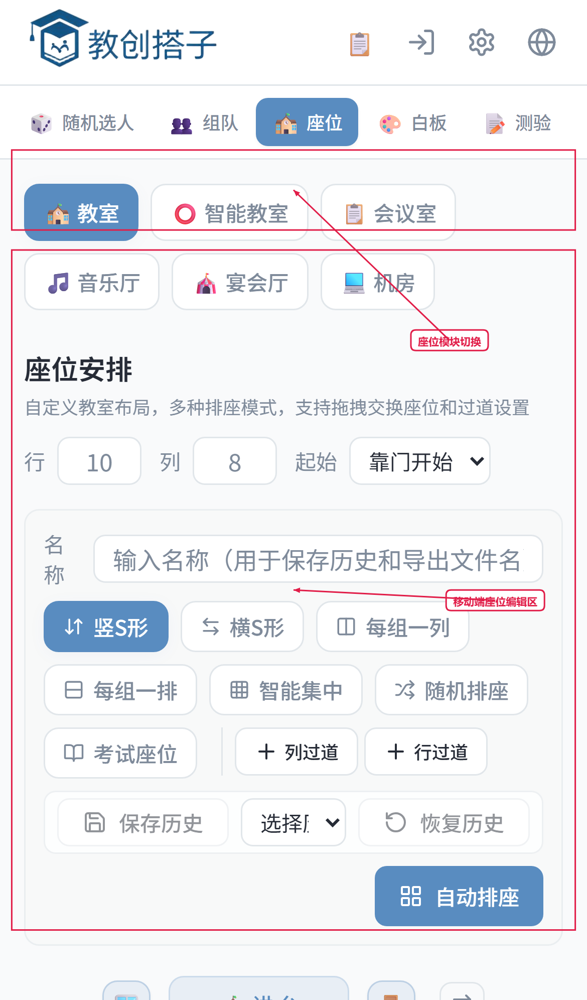
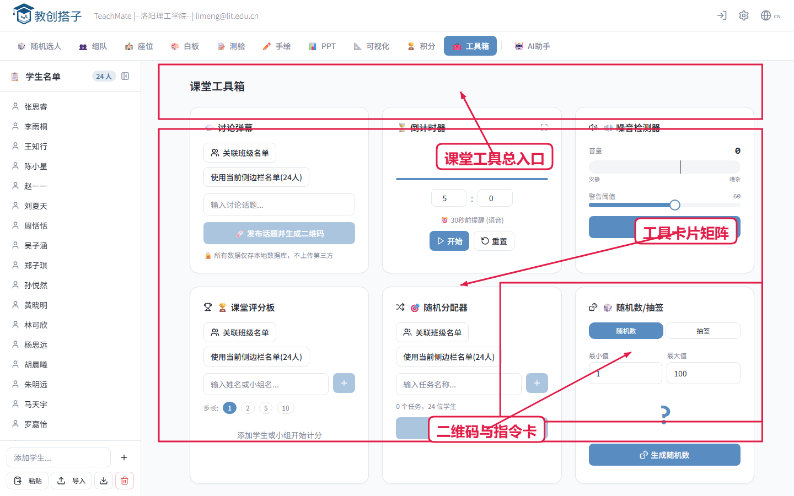
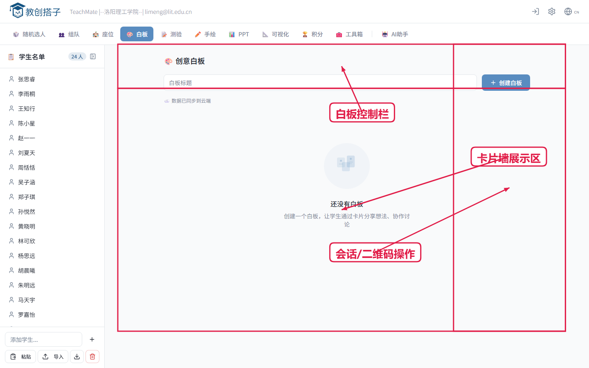
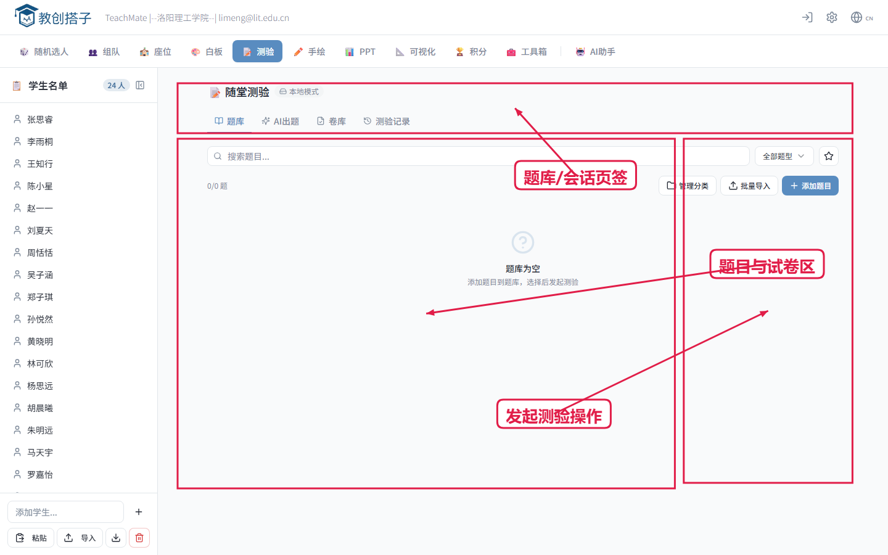
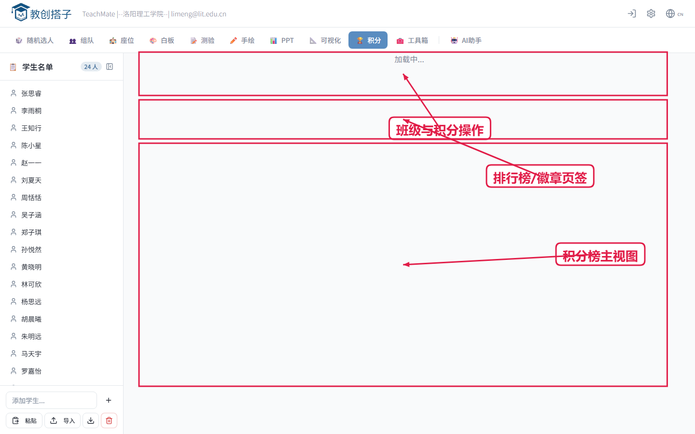

# 课堂工具一体化的互动平台V1.0---教创搭子 用户手册

本手册面向教师/课堂组织者，帮助你快速上手核心功能。

## 场景化界面总览

图：应用首页（顶部模块导航 + 左侧名单区 + 主工作区）

图：手机端首页（移动端同样可完成课堂核心操作）

## 1. 快速开始

1. 打开应用首页
2. 导入或维护学生名单
3. 在顶部或侧边导航切换功能模块

## 2. 核心功能使用

## 2.1 随机点名

图：随机点名（支持转盘/滚动抽取、去重、语音播报、抽取历史）

1. 进入随机点名模块
2. 点击开始抽取
3. 可重复抽取或重置结果

## 2.2 分组

图：分组与建队（自动分配后可拖拽微调成员）

1. 进入 `分组` 模块
2. 设置组数
3. 点击 `自动分组`
4. 支持拖拽调整组员和设置组长

## 2.3 建队

1. 进入 `建队` 模块
2. 设置每队人数
3. 点击 `自动建队`
4. 支持拖拽调整和队长标记

## 2.4 多场景排座

图：排座模块（支持多场景、走道/禁用位、拖拽换位、导出）

图：手机端座位视图（适合课中快速调整）

1. 进入 `座位` 模块
2. 选择场景（教室、机房、音乐厅、会议室等）
3. 调整参数后点击 `自动排座` 或 `随机排座`
4. 支持导出 PNG/PDF

## 2.5 签到

1. 打开签到模块并发起签到
2. 学生扫码后自动计入记录
3. 可查看已签到/未签到
4. 支持导出签到记录

## 2.6 工具箱

图：工具箱（倒计时、二维码、指令卡、投票等课堂微工具）

### 课堂指令卡

1. 点击内置指令卡可全屏展示
2. 也可输入自定义主题（如“分组辩论”）
3. 点击 `检索徽章` 后会联网获取候选图标（3-6个）
4. 点选候选图标即可发布该指令
5. 若检索失败或候选不足，系统会自动使用默认 `？` 图标发布

### 二维码生成器

1. 输入链接
2. 自动生成二维码
3. 学生扫码即可访问

### 倒计时

1. 输入分钟数
2. 开始倒计时
3. 可暂停或重置

## 2.7 白板互动

图：白板互动（创建话题、扫码提交、卡片汇总与展示）

1. 进入 `白板` 模块
2. 创建互动板并设置主题
3. 通过二维码让学生提交内容
4. 进行展示、筛选或导出

## 2.8 随堂测验

图：测验模块（题库、会话发布、结果统计与导出）

1. 进入 `测验` 模块
2. 选择题目并发起测验会话
3. 学生扫码或链接答题
4. 课后导出结果数据

## 2.9 成就与积分

图：成就系统（排行榜、积分记录、徽章管理）

1. 进入 `成就` 模块
2. 对学生进行加减分
3. 按规则发放徽章
4. 导出班级激励数据

## 3. 导出说明

- 支持导出 `PNG` 和 `PDF`
- 建议在导出前确认名单、座位和标题
- 导出失败时通常与浏览器权限、网络或页面资源加载有关

## 4. 常见问题

### 4.1 图标检索失败怎么办？

可直接使用默认 `？` 图标，不影响课堂指令发布。

### 4.2 学生没有扫到签到二维码怎么办？

让学生刷新页面重新扫码，或教师端结束后重新发起签到。

### 4.3 导出文件空白/异常怎么办？

1. 刷新页面后重试
2. 确保页面资源已加载完成
3. 优先使用 Chrome/Edge 最新版

## 5. 课堂实操建议

- 课前：提前导入名单并检查场景参数
- 课中：优先使用指令卡、倒计时、签到
- 课后：导出分组、建队、座位或签到记录做留档
